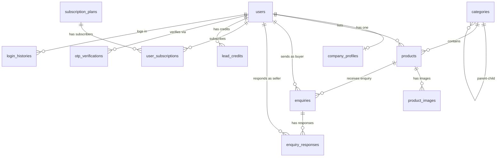

# VVyapar Mitra — IndiaMART B2B Clone: Complete A-to-Z Architecture

---

## 1. IndiaMART Ka Business Model Kya Hai? (Deeply Samjho)

IndiaMART ek **B2B Lead Generation Platform** hai, ye e-commerce site NAHI hai. Iska matlab:
- IndiaMART khud kuch nahi bechta, na hi payment process karta hai.
- Ye sirf **Buyer ko Seller se milata hai** (Discovery + Connection).
- **Paisa kahan se aata hai?** → Sellers se subscription fees aur lead credits se.

### Real-World Flow (Ek Example)

```
Ramesh (Buyer) ko 500 chairs chahiye office ke liye
    ↓
Ramesh IndiaMART app kholke "Office Chairs" search karta hai
    ↓
10 Sellers ki listings dikhti hain (paid wale upar, free wale neeche)
    ↓
Ramesh 3 sellers ko "Send Enquiry" karta hai
    ↓
Ya Ramesh ek "Buy Lead / RFQ" post karta hai: "500 Office Chairs chahiye, Delhi NCR"
    ↓
IndiaMART ka system automatically matching sellers ko ye lead bhejta hai (notification)
    ↓
Seller apne dashboard/app pe lead dekhta hai
    ↓
Seller "Lead Consume" karta hai (credits deduct hote hain) → Buyer ka number milta hai
    ↓
Seller Ramesh ko call karke quote deta hai
    ↓
Deal hoti hai (IndiaMART ka kaam yahan khatam — payment IndiaMART se nahi hota)
```

> [!IMPORTANT]
> **Key Insight:** IndiaMART ka revenue model "connection" pe hai, "transaction" pe nahi. Ye Amazon/Flipkart se bilkul alag hai. Hum bhi yehi model follow karenge.

---

## 2. User System — Buyer & Seller Ek Hi Insaan Hai

IndiaMART mein koi alag "Buyer account" ya "Seller account" nahi hota. **Har user dono hai.**

- Jab koi search karta hai ya enquiry bhejta hai → Wo **Buyer** act kar raha hai
- Jab koi apni company profile banata hai aur products list karta hai → Wo **Seller** act kar raha hai
- Ek hi user dono kaam kar sakta hai

### Users Table Design

```
users
├── id (bigint, PK)
├── phone (varchar 15, unique, indexed) ← Primary identifier (OTP login)
├── name (varchar 100)
├── email (varchar, nullable) ← Optional, later add kare
├── avatar (varchar, nullable)
├── is_phone_verified (boolean, default: false)
├── status (tinyint) ← ACTIVE=1, BLOCKED=2, SUSPENDED=3
├── last_active_at (timestamp, nullable)
├── created_at (timestamp)
├── updated_at (timestamp)
├── deleted_at (timestamp, nullable) ← Soft delete
```

**Constants in Model:**
```php
class User extends Model
{
    const STATUS_ACTIVE    = 1;
    const STATUS_BLOCKED   = 2;
    const STATUS_SUSPENDED = 3;
}
```

---

## 3. Company Profile — Seller Mode Activate

Jab koi user "I want to sell" karta hai, toh uski **Company Profile** banti hai. Ye alag table mein hogi kyunki:
- Har user ke paas company nahi hoti (buyer-only users)
- Ek user ki ek hi company hogi (1:1 relation)
- Company mein bahut zyada fields hain jo user table mein daalna galat hoga

### Company Profiles Table

```
company_profiles
├── id (bigint, PK)
├── user_id (bigint, FK → users, unique) ← One user = One company
├── company_name (varchar 200)
├── slug (varchar 200, unique, indexed) ← URL friendly name
├── business_type (tinyint) ← MANUFACTURER=1, TRADER=2, WHOLESALER=3, DISTRIBUTOR=4, RETAILER=5, SERVICE_PROVIDER=6
├── establishment_year (smallint, nullable)
├── gst_number (varchar 20, nullable)
├── pan_number (varchar 15, nullable)
├── description (text, nullable)
├── logo (varchar, nullable)
├── cover_image (varchar, nullable)
├── employee_count (varchar 50, nullable) ← "1-10", "11-50", etc.
├── annual_turnover (varchar 50, nullable)
├── website (varchar, nullable)
│
├── -- Address Fields --
├── address_line (varchar 255)
├── city (varchar 100, indexed)
├── state (varchar 100, indexed)
├── pincode (varchar 10, indexed)
├── country (varchar 50, default: 'India')
├── latitude (decimal 10,7, nullable)
├── longitude (decimal 10,7, nullable)
│
├── -- Verification --
├── is_verified (boolean, default: false) ← Admin verified
├── verification_status (tinyint) ← PENDING=0, VERIFIED=1, REJECTED=2
├── verified_at (timestamp, nullable)
├── verified_by (bigint, nullable, FK → users) ← Admin who verified
│
├── -- Metrics (denormalized for speed) --
├── total_products (int, default: 0)
├── response_rate (tinyint, default: 0) ← 0-100%
├── avg_response_time (int, nullable) ← Minutes mein
│
├── created_at (timestamp)
├── updated_at (timestamp)
├── deleted_at (timestamp, nullable)
```

**Constants:**
```php
class CompanyProfile extends Model
{
    const BUSINESS_TYPE_MANUFACTURER    = 1;
    const BUSINESS_TYPE_TRADER          = 2;
    const BUSINESS_TYPE_WHOLESALER      = 3;
    const BUSINESS_TYPE_DISTRIBUTOR     = 4;
    const BUSINESS_TYPE_RETAILER        = 5;
    const BUSINESS_TYPE_SERVICE_PROVIDER = 6;

    const VERIFICATION_PENDING  = 0;
    const VERIFICATION_VERIFIED = 1;
    const VERIFICATION_REJECTED = 2;
}
```

---

## 4. Category System — Multi-Level (Self-Referencing)

IndiaMART mein categories 3-4 levels deep hoti hain:
```
Furniture & Supplies (Level 1)
  └── Office Furniture (Level 2)
       └── Office Chairs (Level 3)
            └── Executive Chairs (Level 4)
```

### Categories Table (Self-Referencing — Infinite Levels)

```
categories
├── id (bigint, PK)
├── parent_id (bigint, nullable, FK → categories, indexed) ← NULL = root category
├── name (varchar 150)
├── slug (varchar 150, indexed)
├── icon (varchar, nullable) ← For app display
├── image (varchar, nullable)
├── description (text, nullable)
├── sort_order (int, default: 0) ← Display ordering
├── is_active (boolean, default: true)
├── level (tinyint, default: 0) ← 0=root, 1=sub, 2=sub-sub (denormalized)
├── product_count (int, default: 0) ← Denormalized for speed
├── created_at (timestamp)
├── updated_at (timestamp)
```

> [!TIP]
> **parent_id = NULL** matlab ye root/top-level category hai. `parent_id = 5` matlab ye category id=5 ki child hai. Is tarah infinite nesting ho sakti hai bina nayi table banaye.

**Admin se categories manage hongi (CRUD). API se sirf read hogi.**

---

## 5. Products / Services Catalog

Ye system ka sabse important part hai. Seller apne products list karta hai, Buyer unhe search karta hai.

### Products Table

```
products
├── id (bigint, PK)
├── user_id (bigint, FK → users, indexed) ← Seller who listed
├── category_id (bigint, FK → categories, indexed) ← Leaf category
├── name (varchar 255)
├── slug (varchar 255, indexed)
├── description (text, nullable)
├── price (decimal 12,2, nullable) ← Can be null for "Ask for Price"
├── price_type (tinyint) ← FIXED=1, RANGE=2, ASK=3, PER_UNIT=4
├── min_price (decimal 12,2, nullable) ← For range pricing
├── max_price (decimal 12,2, nullable)
├── price_unit (varchar 50, nullable) ← "per piece", "per kg", "per lot"
├── min_order_qty (int, nullable) ← Minimum Order Quantity
├── min_order_unit (varchar 50, nullable) ← "Pieces", "Kg", "Dozen"
│
├── -- Product Details --
├── brand (varchar 100, nullable)
├── material (varchar 100, nullable)
├── specifications (json, nullable) ← Flexible key-value specs
├── usage_application (varchar 255, nullable)
├── country_of_origin (varchar 50, default: 'India')
│
├── -- Status --
├── status (tinyint) ← DRAFT=0, PENDING=1, ACTIVE=2, REJECTED=3, INACTIVE=4
├── is_featured (boolean, default: false) ← Admin promote kare
├── rejection_reason (varchar 255, nullable)
│
├── -- Metrics --
├── view_count (int, default: 0)
├── enquiry_count (int, default: 0)
│
├── created_at (timestamp)
├── updated_at (timestamp)
├── deleted_at (timestamp, nullable)
```

### Product Images Table (1 Product → Many Images)

```
product_images
├── id (bigint, PK)
├── product_id (bigint, FK → products, indexed)
├── image_path (varchar 500)
├── sort_order (tinyint, default: 0) ← First image = thumbnail
├── created_at (timestamp)
```

**Constants:**
```php
class Product extends Model
{
    const STATUS_DRAFT    = 0;
    const STATUS_PENDING  = 1;
    const STATUS_ACTIVE   = 2;
    const STATUS_REJECTED = 3;
    const STATUS_INACTIVE = 4;

    const PRICE_TYPE_FIXED    = 1;
    const PRICE_TYPE_RANGE    = 2;
    const PRICE_TYPE_ASK      = 3;
    const PRICE_TYPE_PER_UNIT = 4;
}
```

---

## 6. Enquiry / Lead System — The Heart of the Business

Ye IndiaMART ka core hai. Do tarah ki enquiries hoti hain:

### Type 1: Direct Enquiry (Buyer → Specific Seller)
Buyer kisi product page pe "Contact Supplier" click karta hai.

### Type 2: Buy Lead / RFQ (Buyer → Multiple Matching Sellers)
Buyer ek general requirement post karta hai. System matching sellers ko distribute karta hai.

### Enquiries Table

```
enquiries
├── id (bigint, PK)
├── reference_id (varchar 20, unique) ← Human-readable ID like "ENQ-20260915-001"
├── type (tinyint) ← DIRECT=1, RFQ=2
│
├── -- Buyer Info --
├── buyer_id (bigint, FK → users, indexed)
├── buyer_name (varchar 100) ← Snapshot at time of enquiry
├── buyer_phone (varchar 15)
├── buyer_city (varchar 100, nullable)
│
├── -- What they need --
├── product_id (bigint, nullable, FK → products) ← For DIRECT type
├── category_id (bigint, nullable, FK → categories) ← For RFQ type
├── subject (varchar 255) ← "Need 500 Office Chairs"
├── message (text, nullable) ← Detailed requirement
├── quantity (int, nullable)
├── quantity_unit (varchar 50, nullable)
├── budget (decimal 12,2, nullable)
├── delivery_location (varchar 200, nullable)
│
├── -- For Direct Enquiry --
├── seller_id (bigint, nullable, FK → users, indexed) ← Target seller (DIRECT type)
│
├── -- Status --
├── status (tinyint) ← OPEN=0, RESPONDED=1, CLOSED=2, SPAM=3
│
├── -- Metadata --
├── max_sellers (tinyint, default: 6) ← Max sellers who can consume this lead
├── consumed_count (tinyint, default: 0)
├── expires_at (timestamp, nullable) ← Lead expiry
│
├── created_at (timestamp)
├── updated_at (timestamp)
```

### Enquiry Responses Table (Seller Consumes Lead & Responds)

```
enquiry_responses
├── id (bigint, PK)
├── enquiry_id (bigint, FK → enquiries, indexed)
├── seller_id (bigint, FK → users, indexed) ← Seller who consumed/responded
├── status (tinyint) ← CONSUMED=1, QUOTED=2, ACCEPTED=3, REJECTED=4
├── quote_amount (decimal 12,2, nullable)
├── quote_message (text, nullable)
├── quote_validity_days (int, nullable)
├── credits_used (int, default: 1) ← Lead credits deducted
├── responded_at (timestamp, nullable)
├── created_at (timestamp)
├── updated_at (timestamp)
```

**Constants:**
```php
class Enquiry extends Model
{
    const TYPE_DIRECT = 1;
    const TYPE_RFQ    = 2;

    const STATUS_OPEN      = 0;
    const STATUS_RESPONDED = 1;
    const STATUS_CLOSED    = 2;
    const STATUS_SPAM      = 3;
}

class EnquiryResponse extends Model
{
    const STATUS_CONSUMED = 1;
    const STATUS_QUOTED   = 2;
    const STATUS_ACCEPTED = 3;
    const STATUS_REJECTED = 4;
}
```

### Enquiry Flow Diagram:

```
BUYER APP                          BACKEND                           SELLER APP
─────────                          ───────                           ──────────
                                                                   
"Contact Supplier"                                                  
  or "Post Requirement"                                             
        │                                                           
        ▼                                                           
   POST /enquiries ─────────►  Create Enquiry                      
                               (validate, save)                     
                                     │                              
                                     ▼                              
                              If TYPE = DIRECT:                     
                              ├─ Notify specific seller             
                              │                                     
                              If TYPE = RFQ:                        
                              ├─ MatchLeadWithSellers (Job)         
                              │  → Find sellers in same category    
                              │  → Filter by city/state             
                              │  → Sort by subscription tier        
                              │  → Limit to max_sellers             
                              ├─ Send Push/SMS to each ──────────► "New Lead!"
                                                                       │
                                                                       ▼
                                                              View Lead Details
                                                              (subject, qty, city)
                                                                       │
                                                                       ▼
                                                              "Consume Lead"
                                                              POST /enquiries/{id}/consume
                                                                       │
                              ◄────────────────────────────────────────┘
                              Deduct credits                  
                              Reveal buyer contact             
                              Return buyer phone ─────────────► Seller sees phone
                                                                       │
                                                                       ▼
                                                              "Send Quote"
                                                              POST /enquiries/{id}/quote
                                                                       │
        ◄──────────────────────────────────────────────────────────────┘
   Buyer gets notification                                    
   "Seller sent you a quote"                                  
        │                                                     
        ▼                                                     
   View Quote → Call seller → Deal finalized (outside platform)
```

---

## 7. Subscription & Lead Credits System

Sellers ko leads dekhne ke liye subscription lena padta hai.

### Subscription Plans Table

```
subscription_plans
├── id (bigint, PK)
├── name (varchar 100) ← "Free", "Silver", "Gold", "Platinum"
├── slug (varchar 100, unique)
├── description (text, nullable)
├── price_monthly (decimal 10,2)
├── price_yearly (decimal 10,2)
├── leads_per_week (int) ← Weekly lead quota
├── bonus_leads_daily (int, default: 0) ← Extra daily bonus
├── max_products (int) ← Max products seller can list
├── features (json) ← {"priority_listing": true, "verified_badge": true, "analytics": true}
├── is_active (boolean, default: true)
├── sort_order (tinyint, default: 0)
├── created_at (timestamp)
├── updated_at (timestamp)
```

### User Subscriptions Table

```
user_subscriptions
├── id (bigint, PK)
├── user_id (bigint, FK → users, indexed)
├── plan_id (bigint, FK → subscription_plans)
├── status (tinyint) ← ACTIVE=1, EXPIRED=2, CANCELLED=3
├── starts_at (timestamp)
├── ends_at (timestamp)
├── amount_paid (decimal 10,2)
├── payment_method (varchar 50, nullable)
├── payment_reference (varchar 100, nullable)
├── auto_renew (boolean, default: false)
├── created_at (timestamp)
├── updated_at (timestamp)
```

### Lead Credits Table (Wallet-style tracking)

```
lead_credits
├── id (bigint, PK)
├── user_id (bigint, FK → users, indexed)
├── type (tinyint) ← WEEKLY_QUOTA=1, DAILY_BONUS=2, PURCHASED=3, REFUND=4
├── credits (int) ← Positive = credit, Negative = debit
├── balance_after (int) ← Running balance
├── enquiry_id (bigint, nullable, FK → enquiries) ← Which lead consumed
├── description (varchar 255, nullable)
├── created_at (timestamp)
```

---

## 8. OTP Authentication System

### OTP Verifications Table

```
otp_verifications
├── id (bigint, PK)
├── phone (varchar 15, indexed)
├── otp (varchar 6)
├── purpose (tinyint) ← LOGIN=1, REGISTER=2, PHONE_CHANGE=3
├── attempts (tinyint, default: 0)
├── max_attempts (tinyint, default: 3)
├── is_verified (boolean, default: false)
├── expires_at (timestamp)
├── verified_at (timestamp, nullable)
├── created_at (timestamp)
```

### Auth Flow:
```
1. POST /api/v1/auth/send-otp     → { phone: "9876543210" }
2. Backend generates OTP, saves in DB, sends via SMS gateway
3. POST /api/v1/auth/verify-otp   → { phone: "9876543210", otp: "123456" }
4. Backend verifies → Creates/finds user → Returns Sanctum token
5. Token used in all subsequent API calls (Bearer token)
```

### Multi-Device Support (Sanctum):
- Har device ka alag token hoga (Sanctum `personal_access_tokens` table mein).
- Login hone par naya token create hoga, purane tokens valid rahenge.
- Logout par sirf current device ka token revoke hoga.

---

## 9. Supporting Tables

### Login History

```
login_histories
├── id (bigint, PK)
├── user_id (bigint, FK → users, indexed)
├── ip_address (varchar 45)
├── user_agent (varchar 500, nullable)
├── device_type (varchar 50, nullable) ← "android", "ios", "web"
├── login_at (timestamp)
├── created_at (timestamp)
```

### Application Errors (Already exists — keep as is)

```
application_errors ← Error logs for debugging (already in your project)
```

### Communication Logs

```
communication_logs
├── id (bigint, PK)
├── user_id (bigint, nullable, FK → users)
├── channel (tinyint) ← SMS=1, EMAIL=2, PUSH=3, WHATSAPP=4
├── to (varchar 200)
├── subject (varchar 255, nullable)
├── content (text)
├── status (tinyint) ← SENT=1, FAILED=2, DELIVERED=3
├── provider_response (text, nullable)
├── created_at (timestamp)
```

### Settings (Key-Value store for admin config)

```
settings
├── id (bigint, PK)
├── key (varchar 100, unique)
├── value (text, nullable)
├── created_at (timestamp)
├── updated_at (timestamp)
```

---

## 10. Complete ER Diagram



---

## 11. Admin Dashboard (Tabler) — Kya Kya Manage Hoga

### Sidebar Structure:
```
Dashboard
│
├── PEOPLE
│   ├── Users (All / Buyers / Sellers / Blocked)
│   └── Company Profiles (Pending Verification / Verified / Rejected)
│
├── CATALOG
│   ├── Categories (Tree view — Add/Edit/Reorder)
│   └── Products (All / Pending Approval / Active / Rejected)
│
├── BUSINESS
│   ├── Enquiries (All / Direct / RFQ / Open / Closed)
│   ├── Leads Dashboard (Today's leads, conversion metrics)
│   └── Subscriptions (Plans / Active Subscriptions / Expiring Soon)
│
├── SYSTEM
│   ├── Error Logs
│   ├── Communication Logs
│   └── Settings
```

---

## 12. Laravel Architecture (Clean Code, 10+ Year Stability)

### Directory Structure:
```
app/
├── Http/
│   ├── Controllers/
│   │   ├── Admin/           ← Web controllers (Tabler dashboard)
│   │   │   ├── DashboardController.php
│   │   │   ├── UserController.php
│   │   │   ├── CompanyController.php
│   │   │   ├── CategoryController.php
│   │   │   ├── ProductController.php
│   │   │   ├── EnquiryController.php
│   │   │   ├── SubscriptionController.php
│   │   │   └── System/
│   │   │       ├── ErrorLogController.php
│   │   │       └── SettingController.php
│   │   └── Api/
│   │       ├── Auth/
│   │       │   └── AuthController.php
│   │       ├── CategoryController.php
│   │       ├── ProductController.php
│   │       ├── EnquiryController.php
│   │       ├── CompanyController.php
│   │       └── SubscriptionController.php
│   └── Requests/            ← Form Request Validation
│       ├── Api/
│       │   ├── SendOtpRequest.php
│       │   ├── VerifyOtpRequest.php
│       │   ├── StoreProductRequest.php
│       │   ├── StoreEnquiryRequest.php
│       │   └── UpdateCompanyRequest.php
│       └── Admin/
│           ├── StoreCategoryRequest.php
│           └── StoreSubscriptionPlanRequest.php
│
├── Models/                  ← Eloquent Models (with Constants)
│   ├── User.php
│   ├── CompanyProfile.php
│   ├── Category.php
│   ├── Product.php
│   ├── ProductImage.php
│   ├── Enquiry.php
│   ├── EnquiryResponse.php
│   ├── SubscriptionPlan.php
│   ├── UserSubscription.php
│   ├── LeadCredit.php
│   ├── OtpVerification.php
│   ├── LoginHistory.php
│   ├── CommunicationLog.php
│   ├── Setting.php
│   └── ApplicationError.php
│
├── Services/                ← Business Logic (NO logic in controllers!)
│   ├── OtpService.php
│   ├── AuthService.php
│   ├── ProductService.php
│   ├── EnquiryService.php
│   ├── LeadMatchingService.php
│   ├── SubscriptionService.php
│   ├── LeadCreditService.php
│   └── NotificationService.php
│
├── Exceptions/              ← Custom Exceptions
│   ├── InsufficientLeadCreditsException.php
│   ├── OtpExpiredException.php
│   ├── OtpMaxAttemptsException.php
│   ├── SubscriptionRequiredException.php
│   ├── ProductLimitExceededException.php
│   └── CompanyNotVerifiedException.php
│
├── Jobs/                    ← Background Jobs (Queue)
│   ├── MatchLeadWithSellers.php    ← RFQ → Find matching sellers
│   ├── SendOtpSms.php
│   ├── SendPushNotification.php
│   └── RefreshLeadCredits.php      ← Weekly quota reset
│
└── DataTables/              ← Yajra DataTables (Admin tables)
    ├── UsersDataTable.php
    ├── ProductsDataTable.php
    ├── EnquiriesDataTable.php
    └── CompaniesDataTable.php
```

---

## 13. Implementation Phases (Build Order)

> [!IMPORTANT]
> **Phase-wise approach se hi stability aur clean code aayega. Sab ek saath mat banao.**

### Phase 1: Foundation (Week 1-2)
- [x] Project setup (Docker, Git, Tabler theme) ← **DONE**
- [ ] OTP Auth system (send-otp, verify-otp, Sanctum tokens)
- [ ] User model cleanup (constants, soft deletes)
- [ ] Admin: User listing with DataTables

### Phase 2: Catalog (Week 3-4)
- [ ] Category CRUD (Admin + API read)
- [ ] Company Profile (API create/update + Admin verify)
- [ ] Product CRUD (Seller API + Admin moderation)
- [ ] Product images upload

### Phase 3: Lead Engine (Week 5-6)
- [ ] Direct Enquiry flow (Buyer → Seller)
- [ ] RFQ / Buy Lead flow (Buyer → System → Multiple Sellers)
- [ ] Lead matching algorithm (Job-based)
- [ ] Lead consumption & credit deduction

### Phase 4: Monetization (Week 7-8)
- [ ] Subscription plans (Admin CRUD)
- [ ] User subscription purchase flow
- [ ] Lead credit system (weekly quota, daily bonus, purchased)
- [ ] Product listing limits based on plan

### Phase 5: Polish (Week 9-10)
- [ ] Push notifications (FCM)
- [ ] Search & filters optimization
- [ ] Admin dashboard stats
- [ ] Communication logs

---

## 14. 10+ Year Stability Rules

| Rule | Why |
|------|-----|
| **Constants in Models** (`User::STATUS_ACTIVE`) | Magic numbers se bugs aate hain 5 saal baad |
| **Services layer** (no logic in controllers) | Controller slim, logic reusable across API+Admin |
| **Form Requests** for validation | Validation centralized, testable, consistent |
| **Custom Exceptions** | Clean error handling, API-friendly responses |
| **Soft Deletes everywhere** | Data kabhi permanently nahi jayega |
| **`created_at` on ALL tables** | Audit trail, debugging, analytics |
| **JSON columns for flexible specs** | Schema change nahi karna padega naye attributes ke liye |
| **Denormalized counters** (`product_count`, `enquiry_count`) | Avoid expensive COUNT queries on millions of rows |
| **Queue-based processing** | Lead matching, notifications async = fast API response |
| **No Livewire/Alpine** | Plain Blade + jQuery/Vanilla JS = zero framework churn |

