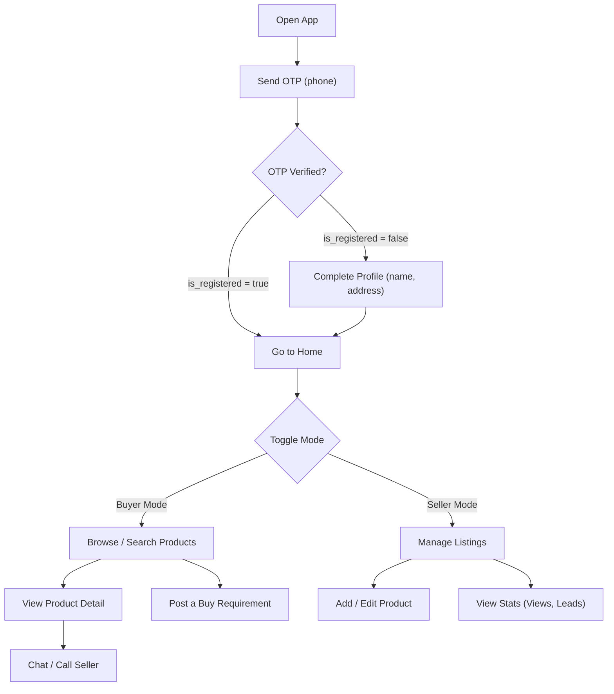

# VVyaparMitra — Full Platform Architecture (OLX + IndiaMART Hybrid)

## Concept Summary

A B2C marketplace where **every user is both a buyer and a seller**. No company/shop concept. Users log in via OTP, toggle between buyer/seller mode in-app, list products (new or used), browse & search products, post buy requirements, and communicate via in-app chat & calls. The platform owns all communication data.

---

## User Flow

---

## Database Schema

### Existing Tables (No Change Needed)
- `users` — Already has phone, name, city, pincode, lat/long, status, role, soft deletes. ✅
- `categories` — Already has parent_id, slug, is_featured, is_active, sort_order, soft deletes. ✅
- `comments` — Polymorphic admin notes. ✅
- `otp_verifications` — OTP flow. ✅
- `personal_access_tokens` — Sanctum auth with device info. ✅

### Users Table — Minor Additions

| Column | Type | Description |
|--------|------|-------------|
| `is_registered` | `boolean` default `false` | `true` after user completes profile (name + address) |
| `address` | `text` nullable | Full address text |
| `state` | `varchar(100)` nullable | State name |

> [!NOTE]
> `is_registered` lets the Flutter app know whether to show the profile completion screen after OTP verify. Once user submits name + address, backend sets `is_registered = true`.

---

### Products Table (NEW)

| Column | Type | Description |
|--------|------|-------------|
| `id` | `bigint PK` | — |
| `user_id` | `FK → users` | The seller |
| `category_id` | `FK → categories` | **Leaf category only** |
| `title` | `varchar(255)` | Product name |
| `slug` | `varchar(255)` unique | Auto-generated from title |
| `description` | `text` nullable | Product details |
| `price` | `decimal(12,2)` | Asking price |
| `is_negotiable` | `boolean` default `true` | Price negotiable? |
| `condition` | `tinyint` | `1=New, 2=Used/Second-hand` |
| `quantity` | `int` default `1` | Available quantity |
| `location` | `varchar(255)` nullable | Seller's location for this product |
| `pincode` | `varchar(10)` nullable | Delivery pincode |
| `city` | `varchar(100)` nullable | City |
| `latitude` | `decimal(10,7)` nullable | — |
| `longitude` | `decimal(10,7)` nullable | — |
| `status` | `tinyint` default `1` | `1=Active, 2=Sold, 3=Expired, 4=Draft, 5=Under Review` |
| `views_count` | `int` default `0` | Cached counter |
| `leads_count` | `int` default `0` | Cached counter for inquiries |
| `is_featured` | `boolean` default `false` | Admin-promoted / trending |
| `featured_at` | `timestamp` nullable | When it was featured |
| `expires_at` | `timestamp` nullable | Auto-expire listing after X days |
| `timestamps` | — | created_at, updated_at |
| `deleted_at` | `timestamp` | Soft delete |

**Indexes:** `user_id`, `category_id`, `status`, `city`, `condition`, `is_featured`, `created_at`

---

### Product Images Table (NEW)

| Column | Type | Description |
|--------|------|-------------|
| `id` | `bigint PK` | — |
| `product_id` | `FK → products` | — |
| `image_path` | `varchar(255)` | Storage path |
| `sort_order` | `tinyint` default `0` | Display order |
| `is_primary` | `boolean` default `false` | Main image |
| `timestamps` | — | — |

---

### Requirements Table (NEW) — Buyer Posts

| Column | Type | Description |
|--------|------|-------------|
| `id` | `bigint PK` | — |
| `user_id` | `FK → users` | Buyer who posted |
| `category_id` | `FK → categories` nullable | Desired category |
| `title` | `varchar(255)` | What they want |
| `description` | `text` nullable | Additional details |
| `quantity` | `int` default `1` | Required qty |
| `target_budget` | `decimal(12,2)` nullable | Budget |
| `delivery_location` | `varchar(255)` nullable | Where they need it |
| `delivery_pincode` | `varchar(10)` nullable | — |
| `status` | `tinyint` default `1` | `1=Open, 2=Fulfilled, 3=Closed, 4=Expired` |
| `expires_at` | `timestamp` nullable | Auto-expire |
| `timestamps` | — | — |
| `deleted_at` | `timestamp` | Soft delete |

---

### Requirement Images Table (NEW)

| Column | Type | Description |
|--------|------|-------------|
| `id` | `bigint PK` | — |
| `requirement_id` | `FK → requirements` | — |
| `image_path` | `varchar(255)` | Reference image |
| `sort_order` | `tinyint` default `0` | — |
| `timestamps` | — | — |

---

### Leads Table (NEW) — Interest / Inquiry

| Column | Type | Description |
|--------|------|-------------|
| `id` | `bigint PK` | — |
| `product_id` | `FK → products` nullable | If inquiry on a product |
| `requirement_id` | `FK → requirements` nullable | If response to a requirement |
| `buyer_id` | `FK → users` | Who showed interest |
| `seller_id` | `FK → users` | Product/requirement owner |
| `message` | `text` nullable | Initial inquiry message |
| `status` | `tinyint` default `1` | `1=New, 2=Contacted, 3=Converted, 4=Rejected` |
| `timestamps` | — | — |

> [!IMPORTANT]
> A lead is created when a buyer clicks "Chat" or "Inquire" on a product, or a seller responds to a requirement. This tracks business value for analytics.

---

### Conversations Table (NEW) — Chat System

| Column | Type | Description |
|--------|------|-------------|
| `id` | `bigint PK` | — |
| `product_id` | `FK → products` nullable | Context: which product |
| `requirement_id` | `FK → requirements` nullable | Context: which requirement |
| `buyer_id` | `FK → users` | — |
| `seller_id` | `FK → users` | — |
| `last_message_at` | `timestamp` nullable | For sorting |
| `buyer_unread_count` | `int` default `0` | — |
| `seller_unread_count` | `int` default `0` | — |
| `status` | `tinyint` default `1` | `1=Active, 2=Archived, 3=Blocked` |
| `timestamps` | — | — |

**Unique:** `(product_id, buyer_id, seller_id)` — One conversation per product per pair.

---

### Messages Table (NEW)

| Column | Type | Description |
|--------|------|-------------|
| `id` | `bigint PK` | — |
| `conversation_id` | `FK → conversations` | — |
| `sender_id` | `FK → users` | — |
| `type` | `tinyint` default `1` | `1=Text, 2=Image, 3=Call Log, 4=System` |
| `body` | `text` nullable | Message content |
| `media_path` | `varchar(255)` nullable | Image/file if type=2 |
| `read_at` | `timestamp` nullable | When the other party read it |
| `timestamps` | — | — |
| `deleted_at` | `timestamp` | Soft delete |

---

### Calls Table (NEW)

| Column | Type | Description |
|--------|------|-------------|
| `id` | `bigint PK` | — |
| `conversation_id` | `FK → conversations` nullable | — |
| `caller_id` | `FK → users` | — |
| `receiver_id` | `FK → users` | — |
| `status` | `tinyint` | `1=Initiated, 2=Ringing, 3=Connected, 4=Missed, 5=Rejected, 6=Ended` |
| `started_at` | `timestamp` nullable | — |
| `ended_at` | `timestamp` nullable | — |
| `duration_seconds` | `int` default `0` | — |
| `timestamps` | — | — |

---

### Product Views Table (NEW) — Analytics

| Column | Type | Description |
|--------|------|-------------|
| `id` | `bigint PK` | — |
| `product_id` | `FK → products` | — |
| `user_id` | `FK → users` nullable | null = anonymous guest |
| `ip_address` | `varchar(45)` nullable | — |
| `timestamps` | — | — |

---

## API Endpoints Plan

### Auth (Existing ✅)
| Method | Endpoint | Auth | Description |
|--------|----------|------|-------------|
| POST | `/api/v1/auth/send-otp` | ❌ | Send OTP |
| POST | `/api/v1/auth/verify-otp` | ❌ | Verify OTP, returns `is_registered` flag |
| POST | `/api/v1/auth/logout` | ✅ | Logout current device |
| GET | `/api/v1/auth/me` | ✅ | Get profile |

### Profile (NEW)
| Method | Endpoint | Auth | Description |
|--------|----------|------|-------------|
| PUT | `/api/v1/profile` | ✅ | Update profile (name, address, city, pincode, email, photo). Sets `is_registered = true` on first complete profile |

### Categories (Existing ✅)
| Method | Endpoint | Auth | Description |
|--------|----------|------|-------------|
| GET | `/api/v1/categories` | ❌ | All active categories (tree) |
| GET | `/api/v1/categories/featured` | ❌ | Featured categories |
| GET | `/api/v1/categories/{slug}` | ❌ | Single category + children |

### Products (NEW)
| Method | Endpoint | Auth | Description |
|--------|----------|------|-------------|
| GET | `/api/v1/products` | ❌ | Browse/search (filters: category, city, condition, price range, search query, sort) |
| GET | `/api/v1/products/trending` | ❌ | Trending/featured products |
| GET | `/api/v1/products/{slug}` | ❌ | Product detail (increments view count) |
| POST | `/api/v1/products` | ✅ | Create product listing (seller) |
| PUT | `/api/v1/products/{id}` | ✅ | Update product (seller, owner only) |
| DELETE | `/api/v1/products/{id}` | ✅ | Soft delete product (seller) |
| GET | `/api/v1/my/products` | ✅ | My listings with stats (views, leads) |
| PATCH | `/api/v1/products/{id}/status` | ✅ | Mark as sold, reactivate, etc |
| POST | `/api/v1/products/{id}/images` | ✅ | Upload images |
| DELETE | `/api/v1/products/images/{id}` | ✅ | Delete an image |

### Requirements (NEW)
| Method | Endpoint | Auth | Description |
|--------|----------|------|-------------|
| GET | `/api/v1/requirements` | ❌ | Browse open buy requirements |
| POST | `/api/v1/requirements` | ✅ | Post a new requirement (buyer) |
| PUT | `/api/v1/requirements/{id}` | ✅ | Edit requirement |
| DELETE | `/api/v1/requirements/{id}` | ✅ | Soft delete |
| GET | `/api/v1/my/requirements` | ✅ | My posted requirements |

### Leads (NEW)
| Method | Endpoint | Auth | Description |
|--------|----------|------|-------------|
| POST | `/api/v1/leads` | ✅ | Create inquiry (buyer → product, or seller → requirement) |
| GET | `/api/v1/my/leads` | ✅ | My leads (as seller: received; as buyer: sent) |
| PATCH | `/api/v1/leads/{id}/status` | ✅ | Update lead status |

### Chat (NEW)
| Method | Endpoint | Auth | Description |
|--------|----------|------|-------------|
| GET | `/api/v1/conversations` | ✅ | List my conversations |
| POST | `/api/v1/conversations` | ✅ | Start conversation (auto-creates or returns existing) |
| GET | `/api/v1/conversations/{id}/messages` | ✅ | Get messages (paginated) |
| POST | `/api/v1/conversations/{id}/messages` | ✅ | Send a message |
| POST | `/api/v1/conversations/{id}/read` | ✅ | Mark as read |

### Calls (NEW)
| Method | Endpoint | Auth | Description |
|--------|----------|------|-------------|
| POST | `/api/v1/calls/initiate` | ✅ | Start a call |
| PATCH | `/api/v1/calls/{id}/status` | ✅ | Update call status (connect, end, miss) |
| GET | `/api/v1/my/calls` | ✅ | Call history |

### Home / Dashboard (NEW)
| Method | Endpoint | Auth | Description |
|--------|----------|------|-------------|
| GET | `/api/v1/home` | ❌ | Combined: featured categories + trending products + latest products (for home screen) |
| GET | `/api/v1/seller/dashboard` | ✅ | Stats: total products, active, views, leads, chats |

---

## Implementation Phases

### Phase 1 — Core Foundation (Do First)
1. Users table migration (`is_registered`, `address`, `state`)
2. Profile Update API (`PUT /api/v1/profile`)
3. Update `verify-otp` response to include `is_registered`
4. Products CRUD (Model, Migration, API, Images)
5. Products Admin Panel (DataTable, CRUD, like Categories)

### Phase 2 — Marketplace Features
6. Product search & filter API (category, price, city, condition)
7. Trending/Featured products logic
8. Home screen API
9. Product Views tracking
10. Requirements CRUD (Model, Migration, API)

### Phase 3 — Communication
11. Leads/Inquiries system
12. Conversations & Messages (REST APIs)
13. WebSocket integration (Laravel Reverb or Pusher) for real-time chat
14. Calls tracking system

### Phase 4 — Admin & Analytics
15. Products Admin Panel (manage, approve, moderate)
16. Leads Admin Panel
17. Requirements Admin Panel
18. Seller Dashboard API
19. Reports & Analytics for admin

---

## Open Questions

> [!IMPORTANT]
> **1. Product Approval:** Kya products directly publish ho jayengi ya admin approval chahiye pehle? (OLX style = direct, IndiaMART = review first)

> [!IMPORTANT]
> **2. Product Expiry:** Products kitne din baad auto-expire hongi? (OLX: 30 days, IndiaMART: 90 days). Ya koi expiry nahi?

> [!IMPORTANT]
> **3. Chat Technology:** Real-time chat ke liye — Laravel Reverb (self-hosted WebSocket, free) ya Pusher (cloud, paid but easy)? Ya pehle simple REST-based polling chat bana dein, baad me WebSocket add karein?

> [!IMPORTANT]
> **4. Call System:** In-app calls ka matlab — actual VoIP (Agora/Twilio) ya phone number masking? Ya sirf call logs track karne hain (user manually call karega)?

> [!IMPORTANT]
> **5. Product Images Limit:** Ek product me max kitni images allow karni hain? (Suggested: 5-10)

> [!IMPORTANT]
> **6. Location:** Products aur search location-based honi chahiye? (nearby first, like OLX) Ya city-based filter kaafi hai?
